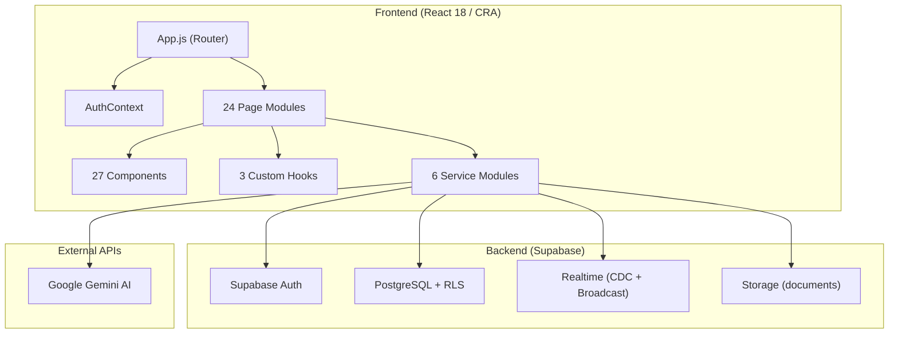

# LegalConnect — Production Codebase Audit Report

> **Audited by**: Principal Software Engineer / Full-Stack Architect / QA Lead  
> **Date**: 2026-07-21  
> **Codebase**: React 18 + Supabase + Tailwind CSS (CRA)  
> **Deployment**: Vercel  

---

## Table of Contents

1. [Executive Summary](#executive-summary)
2. [Architecture Overview](#architecture-overview)
3. [Issues Register](#issues-register)
4. [Final Scorecard](#final-scorecard)

---

## Executive Summary

LegalConnect is a legal marketplace connecting clients with lawyers in Bangladesh. The codebase is a React 18 single-page application using Supabase as the backend (auth, database, storage, realtime). The project has ~24 pages, ~27 components, 6 services, 3 custom hooks, and 71 SQL migration files.

**Key findings**: The application has solid core functionality and a well-structured role-based routing system, but suffers from **critical security vulnerabilities** (hardcoded API keys committed to git, exposed Supabase credentials in source, Gemini API key exposed client-side), **significant architectural debt** (god-components exceeding 1000+ lines, massive SQL migration sprawl with 71 files), and **several broken or incomplete workflows** (non-functional social login buttons, dead code modules). The database layer shows evidence of extensive patching rather than planned migrations.

---

## Architecture Overview

---

## Issues Register

### Issue #1: Hardcoded API Keys & Secrets Committed to Git

| Field | Detail |
|---|---|
| **Severity** | 🔴 **Critical** |
| **Category** | Security |
| **Location** | [.env](file:///e:/University/9th%20semester/P_three/LegalConnect/.env) (entire file) |
| **Description** | The `.env` file contains live Supabase URL, publishable key, and Google Gemini API key. Although `.env` is in `.gitignore`, it is tracked in git history (the file exists in the repo). |
| **Root Cause** | `.env` was committed before `.gitignore` was configured, or was force-added. |
| **Impact** | Any person with repo access has full Supabase and Gemini API credentials. Supabase key allows direct database querying. Gemini key allows unlimited API calls billed to the project owner. |
| **Recommended Fix** | 1. Rotate ALL exposed credentials immediately. 2. Use `git filter-branch` or `BFG Repo-Cleaner` to purge `.env` from history. 3. Add CI/CD secret scanning (e.g., GitHub secret scanning). |
| **Priority** | P0 — Immediate |

---

### Issue #2: Supabase Credentials Hardcoded as Fallback in Source Code

| Field | Detail |
|---|---|
| **Severity** | 🔴 **Critical** |
| **Category** | Security |
| **Location** | [supabase.js:3-4](file:///e:/University/9th%20semester/P_three/LegalConnect/src/services/supabase.js#L3-L4) |
| **Description** | The Supabase URL and anon key are hardcoded as fallback values: `|| 'https://kyjjwfvfoncohkziqsae.supabase.co'` and `|| 'sb_publishable_...'`. These are bundled into the production JavaScript and visible to anyone inspecting the browser bundle. |
| **Root Cause** | Defensive coding against missing env vars, but the fallback values are real credentials. |
| **Impact** | Anyone can extract the Supabase project URL and anon key from the production bundle, enabling direct API calls bypassing any frontend authorization logic. |
| **Recommended Fix** | Remove hardcoded fallbacks. Fail fast if env vars are missing. Add a build-time check that fails the build if `REACT_APP_SUPABASE_URL` is not set. |
| **Priority** | P0 — Immediate |

---

### Issue #3: Google Gemini API Key Exposed Client-Side

| Field | Detail |
|---|---|
| **Severity** | 🔴 **Critical** |
| **Category** | Security |
| **Location** | [AIAdvisor.js:170](file:///e:/University/9th%20semester/P_three/LegalConnect/src/pages/AIAdvisor/AIAdvisor.js#L170) |
| **Description** | The Gemini API key is read from `process.env.REACT_APP_GOOGLE_API_KEY` and used directly in the browser to call the Gemini API. `REACT_APP_*` env vars are embedded in the CRA bundle at build time and visible to all users. |
| **Root Cause** | No server-side proxy. The AI integration is entirely client-side. |
| **Impact** | API key abuse, unauthorized billing, potential data exfiltration through crafted prompts. |
| **Recommended Fix** | Move Gemini calls to a Supabase Edge Function or serverless API route. Only pass the user's prompt; return the result. Never expose API keys to the browser. |
| **Priority** | P0 — Immediate |

---

### Issue #4: `is_admin()` Function Executable by Anonymous Users

| Field | Detail |
|---|---|
| **Severity** | 🔴 **Critical** |
| **Category** | Security / Authorization |
| **Location** | [004_security_and_rls_hardening.sql:170](file:///e:/University/9th%20semester/P_three/LegalConnect/sql/004_security_and_rls_hardening.sql#L170) |
| **Description** | `GRANT EXECUTE ON FUNCTION public.is_admin() TO authenticated, anon;` — The `is_admin()` function is granted to the `anon` role. While the function itself checks `auth.uid()`, granting execute to `anon` is unnecessary and increases the attack surface. Similarly for `is_workspace_participant` and `is_conversation_participant`. |
| **Root Cause** | Over-permissive grants during development. |
| **Impact** | Increases attack surface. An attacker can call these functions directly to probe the system. |
| **Recommended Fix** | Revoke `anon` grants: `REVOKE EXECUTE ON FUNCTION public.is_admin() FROM anon;` — keep only `authenticated`. |
| **Priority** | P0 — Immediate |

---

### Issue #5: Users Table Globally Readable (PII Exposure)

| Field | Detail |
|---|---|
| **Severity** | 🟠 **High** |
| **Category** | Security / RLS |
| **Location** | [09_rls_policies.sql:22](file:///e:/University/9th%20semester/P_three/LegalConnect/sql/09_rls_policies.sql#L22) |
| **Description** | `CREATE POLICY "Users viewable by everyone" ON public.users FOR SELECT USING (true);` — All user data (email, phone, profile info) is readable by any authenticated or anonymous user. |
| **Root Cause** | Over-permissive RLS to simplify development queries. |
| **Impact** | Full PII exposure — emails, phone numbers, profile pictures of all users are accessible via a simple Supabase query from the browser console. |
| **Recommended Fix** | Restrict to: own user can see full record, others can see only `id`, `name`, `profile_picture_url`. Use a view or column-level security. |
| **Priority** | P1 |

---

### Issue #6: Social Login Buttons Are Non-Functional (Broken Workflow)

| Field | Detail |
|---|---|
| **Severity** | 🟠 **High** |
| **Category** | Broken Workflow / UI |
| **Location** | [Register.js:287-295](file:///e:/University/9th%20semester/P_three/LegalConnect/src/pages/Auth/Register.js#L287-L295) |
| **Description** | The registration page renders Google and Apple login buttons, but they have `type="button"` with no `onClick` handler. Clicking them does absolutely nothing. |
| **Root Cause** | Social OAuth was never implemented; UI was added for design purposes. |
| **Impact** | Users attempting social login will be confused and may abandon registration. This is a trust-damaging UX issue for a legal platform. |
| **Recommended Fix** | Either implement Supabase OAuth providers (Google/Apple) or remove the buttons entirely and the "OR CONTINUE WITH" divider. |
| **Priority** | P1 |

---

### Issue #7: God Component — ClientDashboard.js (1183 lines / 67KB)

| Field | Detail |
|---|---|
| **Severity** | 🟠 **High** |
| **Category** | Architecture / Code Quality |
| **Location** | [ClientDashboard.js](file:///e:/University/9th%20semester/P_three/LegalConnect/src/pages/Dashboard/ClientDashboard.js) (1183 lines) |
| **Description** | This single component handles dashboard stats, case listing, case filtering, case detail view, profile editing, profile picture upload, document viewing, payment history, unread messages, notifications, realtime subscriptions — all in one file. |
| **Root Cause** | Monolithic development without component decomposition. |
| **Impact** | Extremely difficult to maintain, test, or debug. Any change risks breaking unrelated functionality. Large bundle size for initial dashboard load. |
| **Recommended Fix** | Split into: `DashboardOverview`, `CaseList`, `CaseDetail`, `ProfileEditor`, `PaymentHistory`, `DocumentViewer` sub-components. Extract data-fetching into custom hooks. |
| **Priority** | P1 |

---

### Issue #8: Duplicate Login Logic — Login.js Bypasses auth.service.js

| Field | Detail |
|---|---|
| **Severity** | 🟡 **Medium** |
| **Category** | Code Quality / Architecture |
| **Location** | [Login.js:54](file:///e:/University/9th%20semester/P_three/LegalConnect/src/pages/Auth/Login.js#L54) vs. [auth.service.js:51](file:///e:/University/9th%20semester/P_three/LegalConnect/src/services/auth.service.js#L51) |
| **Description** | `Login.js` calls `supabase.auth.signInWithPassword()` directly instead of using the `signIn()` function from `auth.service.js`. The `Register.js` correctly uses `signUp()` from the service. This creates two divergent login code paths with different profile hydration logic. |
| **Root Cause** | Incremental development without enforcing the service layer. |
| **Impact** | Profile hydration differences between login and register paths. Bug fixes applied to one path may not apply to the other. |
| **Recommended Fix** | Refactor `Login.js` to call `signIn()` from `auth.service.js`. Centralize all auth logic in the service layer. |
| **Priority** | P2 |

---

### Issue #9: Dead Code Modules — SocketContext.js and axiosInstance.js

| Field | Detail |
|---|---|
| **Severity** | 🟡 **Medium** |
| **Category** | Dead Code |
| **Location** | [SocketContext.js](file:///e:/University/9th%20semester/P_three/LegalConnect/src/context/SocketContext.js), [axiosInstance.js](file:///e:/University/9th%20semester/P_three/LegalConnect/src/utils/axiosInstance.js) |
| **Description** | Both files contain only comments stating they've been removed. They serve no purpose but remain in the codebase. |
| **Root Cause** | Migration from a custom backend to Supabase left behind empty shells. |
| **Impact** | Confusing for new developers. Pollutes the import graph. |
| **Recommended Fix** | Delete both files. Remove any residual imports. |
| **Priority** | P3 |

---

### Issue #10: `.env.example` References Non-Existent Backend Server

| Field | Detail |
|---|---|
| **Severity** | 🟡 **Medium** |
| **Category** | Documentation / Configuration |
| **Location** | [.env.example:7-16](file:///e:/University/9th%20semester/P_three/LegalConnect/.env.example#L7-L16) |
| **Description** | The `.env.example` file contains backend server configuration (`DATABASE_URL`, `JWT_SECRET`, `SMTP_*`) that no longer exists. The project is 100% Supabase — there is no custom backend. |
| **Root Cause** | Legacy config from a previous architecture that was never cleaned up. |
| **Impact** | Misleads developers into thinking there's a backend to configure. Wastes onboarding time. |
| **Recommended Fix** | Remove all backend references from `.env.example`. Add only `REACT_APP_SUPABASE_URL`, `REACT_APP_SUPABASE_PUBLISHABLE_KEY`, `REACT_APP_GOOGLE_API_KEY`. |
| **Priority** | P3 |

---

### Issue #11: `.env` References Dead Backend URLs

| Field | Detail |
|---|---|
| **Severity** | 🟢 **Low** |
| **Category** | Configuration |
| **Location** | [.env:3-4](file:///e:/University/9th%20semester/P_three/LegalConnect/.env#L3-L4) |
| **Description** | `REACT_APP_API_URL=http://localhost:5000` and `REACT_APP_SOCKET_URL=http://localhost:5000` point to a backend that doesn't exist. |
| **Root Cause** | Legacy migration. |
| **Impact** | Minimal — these env vars aren't used in code. But they add confusion. |
| **Recommended Fix** | Remove unused environment variables. |
| **Priority** | P4 |

---

### Issue #12: Corrupted `.gitignore` File (UTF-16 Encoding Corruption)

| Field | Detail |
|---|---|
| **Severity** | 🟡 **Medium** |
| **Category** | Configuration |
| **Location** | [.gitignore:32-36](file:///e:/University/9th%20semester/P_three/LegalConnect/.gitignore#L32-L36) |
| **Description** | Lines 32-36 of `.gitignore` contain UTF-16 encoded null bytes (`\u0000`), making those gitignore rules non-functional. The entries `sql/`, `# LegalConnect.txt`, `make.md`, and `proposal_extracted.txt` are corrupted and NOT being ignored by git. |
| **Root Cause** | File was edited with a tool that injected UTF-16 BOM or a copy-paste from a Word document. |
| **Impact** | SQL migration files, proposal documents, and other sensitive files may be accidentally committed. |
| **Recommended Fix** | Re-create the `.gitignore` file in UTF-8 encoding. Verify with `file .gitignore` or a hex editor. |
| **Priority** | P2 |

---

### Issue #13: SQL Migration Sprawl — 71 Unmanaged Migration Files

| Field | Detail |
|---|---|
| **Severity** | 🟠 **High** |
| **Category** | Database / Architecture |
| **Location** | [sql/](file:///e:/University/9th%20semester/P_three/LegalConnect/sql) (71 files) |
| **Description** | There are 71 SQL migration files with no migration runner, no versioning system, no idempotency guarantees. Files like `25_comprehensive_fixes.sql` (16KB), `26_complete_overhaul.sql` (13KB), and `62_master_workflows_and_visibility_audit.sql` (23KB) suggest repeated large-scale patching. There are two files numbered `45_*`. Some later files (42+) fix issues created by earlier migrations. |
| **Root Cause** | Ad-hoc database development without a proper migration tool (like Supabase CLI migrations, Flyway, or Prisma). |
| **Impact** | Impossible to reliably reproduce the database from scratch. Schema state is unknown — only the production DB (managed by running these scripts manually) is authoritative. |
| **Recommended Fix** | 1. Use `supabase db dump` to capture the current production schema. 2. Create a single baseline migration. 3. Adopt Supabase CLI `supabase migration new` for all future changes. 4. Archive the 71 legacy files. |
| **Priority** | P1 |

---

### Issue #14: Duplicate SQL Migration Numbering

| Field | Detail |
|---|---|
| **Severity** | 🟡 **Medium** |
| **Category** | Database |
| **Location** | `sql/45_financial_and_verification_rpcs.sql` and `sql/45_fix_lawyer_approval_visibility.sql` |
| **Description** | Two files share the migration number `45`. This makes ordering ambiguous and could lead to silent failures if migrations are run in wrong order. |
| **Root Cause** | Manual numbering without coordination. |
| **Impact** | Non-deterministic schema state depending on execution order. |
| **Recommended Fix** | Renumber one of the files. Adopt a timestamp-based naming scheme. |
| **Priority** | P2 |

---

### Issue #15: RLS Policy Uses `auth.uid() = id` Instead of `auth.uid() = auth_id`

| Field | Detail |
|---|---|
| **Severity** | 🟠 **High** |
| **Category** | Security / Authorization |
| **Location** | [09_rls_policies.sql:23](file:///e:/University/9th%20semester/P_three/LegalConnect/sql/09_rls_policies.sql#L23) |
| **Description** | `CREATE POLICY "Users update own data" ON public.users FOR UPDATE USING (auth.uid() = id OR public.is_admin());` — The `users.id` column IS `auth.users(id)` (it's a FK reference), so this works. However, the `auth_id` is a GENERATED column (`auth_id UUID GENERATED ALWAYS AS (id) STORED`), which adds confusion. The redundant `auth_id` column is misleading and used inconsistently throughout the codebase. |
| **Root Cause** | The `auth_id` generated column was added as a workaround but creates ambiguity. |
| **Impact** | Developers are confused about whether to use `id` or `auth_id`, leading to inconsistent queries across the frontend (`user.auth_id || user.id` appears everywhere). |
| **Recommended Fix** | Remove the generated `auth_id` column. Standardize on `users.id = auth.uid()` everywhere. |
| **Priority** | P2 |

---

### Issue #16: Aggressive Realtime Subscriptions Cause N+1 Refetches

| Field | Detail |
|---|---|
| **Severity** | 🟠 **High** |
| **Category** | Performance |
| **Location** | [ClientDashboard.js:55-68](file:///e:/University/9th%20semester/P_three/LegalConnect/src/pages/Dashboard/ClientDashboard.js#L55-L68) |
| **Description** | The client dashboard subscribes to realtime changes on `appointments`, `cases`, `messages`, and `consultation_updates` — and each event triggers a FULL `fetchDashboardData()` which makes 8+ separate database queries. Any single message sent in any workspace triggers a complete dashboard data reload. |
| **Root Cause** | No granular update logic; the handler uses a sledgehammer approach. |
| **Impact** | Excessive database queries, potential rate limiting, UI flickering during rapid updates, wasted bandwidth. |
| **Recommended Fix** | 1. Filter realtime events by user ID. 2. Use targeted state updates instead of full refetch. 3. Add debouncing (e.g., 500ms) before refetching. |
| **Priority** | P1 |

---

### Issue #17: `useLawyers` Hook Uses `JSON.stringify(filters)` as Dependency

| Field | Detail |
|---|---|
| **Severity** | 🟡 **Medium** |
| **Category** | Performance / React Anti-pattern |
| **Location** | [useLawyers.js:98](file:///e:/University/9th%20semester/P_three/LegalConnect/src/hooks/useLawyers.js#L98) |
| **Description** | `useCallback` depends on `JSON.stringify(filters)`. If the parent component passes a new object literal on every render (e.g., `useLawyers({ limit: 50 })`), this creates a new string every render, triggering unnecessary refetches. |
| **Root Cause** | Workaround for object reference instability in dependency arrays. |
| **Impact** | Unnecessary re-renders and API calls on every parent render. |
| **Recommended Fix** | Memoize the filters object with `useMemo` in the parent, or use individual filter values as dependencies. |
| **Priority** | P2 |

---

### Issue #18: AI Advisor Fetches ALL Lawyers Into Memory

| Field | Detail |
|---|---|
| **Severity** | 🟠 **High** |
| **Category** | Performance |
| **Location** | [aiAdvisor.service.js:174-177](file:///e:/University/9th%20semester/P_three/LegalConnect/src/services/aiAdvisor.service.js#L174-L177) |
| **Description** | `queryMatchingLawyers()` fetches ALL verified lawyers, ALL practice areas, ALL legal expertise, and ALL junction table rows into memory, then filters and sorts client-side. |
| **Root Cause** | No server-side filtering or RPC function. |
| **Impact** | As the lawyer pool grows, this will cause increasing memory usage, slow load times, and potential browser freezes. |
| **Recommended Fix** | Create a database RPC function `match_lawyers_for_ai(category, location, need_type, limit, offset)` that performs filtering and sorting at the database level. |
| **Priority** | P1 |

---

### Issue #19: AudioContext Created on Every Incoming Message

| Field | Detail |
|---|---|
| **Severity** | 🟢 **Low** |
| **Category** | Performance / Memory Leak |
| **Location** | [useChatSocket.js:122-135](file:///e:/University/9th%20semester/P_three/LegalConnect/src/hooks/useChatSocket.js#L122-L135) |
| **Description** | The `playPing()` function creates a new `AudioContext` every time a message arrives. AudioContexts are limited resources (browsers cap at ~6 concurrent contexts). The context is never closed. |
| **Root Cause** | Quick implementation without lifecycle management. |
| **Impact** | Memory leak and potential `AudioContext` exhaustion in active chat sessions. Browser console warnings. |
| **Recommended Fix** | Create a single `AudioContext` instance and reuse it. Close it on component unmount. |
| **Priority** | P3 |

---

### Issue #20: No Rate Limiting on Contact Form / Feedback / AI Advisor

| Field | Detail |
|---|---|
| **Severity** | 🟠 **High** |
| **Category** | Security |
| **Location** | [09_rls_policies.sql:119](file:///e:/University/9th%20semester/P_three/LegalConnect/sql/09_rls_policies.sql#L119), AI Advisor page |
| **Description** | The `contact_inquiries` table allows `INSERT WITH CHECK (true)` — anyone (even unauthenticated) can insert unlimited contact inquiries. The AI Advisor makes unlimited Gemini API calls with no throttling. |
| **Root Cause** | No backend middleware; all operations go directly to Supabase. |
| **Impact** | Spam abuse of contact form, AI API cost explosion, potential DoS. |
| **Recommended Fix** | 1. Add RLS rate limiting via a function that checks recent insert count. 2. Move AI calls to Edge Functions with rate limits. 3. Add reCAPTCHA to contact form. |
| **Priority** | P1 |

---

### Issue #21: `updateProfile` Uses `new Date()` Instead of Database Timestamp

| Field | Detail |
|---|---|
| **Severity** | 🟢 **Low** |
| **Category** | Data Integrity |
| **Location** | [useLawyerProfile.js:75](file:///e:/University/9th%20semester/P_three/LegalConnect/src/hooks/useLawyerProfile.js#L75) |
| **Description** | `updated_at: new Date()` sends the client's local clock timestamp, which may differ from the database server time. |
| **Root Cause** | Quick implementation. |
| **Impact** | Timestamps may be inconsistent if clients have wrong clocks. |
| **Recommended Fix** | Use `updated_at: new Date().toISOString()` or better, use a database trigger: `SET updated_at = NOW()`. |
| **Priority** | P3 |

---

### Issue #22: `fetchSingleLawyer` — SQL Injection Vector via `.or()` Construction

| Field | Detail |
|---|---|
| **Severity** | 🟠 **High** |
| **Category** | Security |
| **Location** | [useLawyers.js:121](file:///e:/University/9th%20semester/P_three/LegalConnect/src/hooks/useLawyers.js#L121) |
| **Description** | `query.or(\`slug.eq.${idOrSlug},user_id.eq.${idOrSlug}\`)` — While Supabase's PostgREST escapes values, constructing filter strings via template literals is a code smell and could be vulnerable if the escaping has bugs. The `idOrSlug` comes from URL params (user-controlled). |
| **Root Cause** | Dynamic filter construction without parameterized queries. |
| **Impact** | Potential PostgREST filter injection if escaping is incomplete. |
| **Recommended Fix** | Use separate `.eq()` calls or create an RPC function for this lookup. |
| **Priority** | P2 |

---

### Issue #23: Realtime Sync Reconnect Logic — Only Retries Once

| Field | Detail |
|---|---|
| **Severity** | 🟡 **Medium** |
| **Category** | Reliability |
| **Location** | [realtimeSync.service.js:139-141](file:///e:/University/9th%20semester/P_three/LegalConnect/src/services/realtimeSync.service.js#L139-L141) |
| **Description** | On `CHANNEL_ERROR` or `TIMED_OUT`, the service retries exactly once after 3 seconds. If the retry also fails, realtime updates silently stop working for the entire session. |
| **Root Cause** | No exponential backoff or unlimited retry with jitter. |
| **Impact** | Users lose real-time updates after transient network issues. No UI notification that realtime is disconnected. |
| **Recommended Fix** | Implement exponential backoff (3s, 6s, 12s, max 60s) with unlimited retries. Show a UI indicator when realtime is disconnected. |
| **Priority** | P2 |

---

### Issue #24: Missing Loading States on Key Pages

| Field | Detail |
|---|---|
| **Severity** | 🟡 **Medium** |
| **Category** | UI/UX |
| **Location** | Various pages — PostJob, Workspace, JobDetail |
| **Description** | Several pages lack loading skeleton states and show blank screens or FOUC (flash of unstyled content) before data loads. Only the ClientDashboard imports `SkeletonDashboard`. |
| **Root Cause** | Inconsistent implementation of loading patterns. |
| **Impact** | Poor perceived performance. Users may think the app is broken during data fetching. |
| **Recommended Fix** | Add `PageLoadingSkeleton` (which already exists as a component) to all pages that fetch data on mount. |
| **Priority** | P2 |

---

### Issue #25: `window.location.href` Used Instead of React Router Navigation

| Field | Detail |
|---|---|
| **Severity** | 🟡 **Medium** |
| **Category** | Code Quality / Performance |
| **Location** | [LawyerDashboardView.js:352](file:///e:/University/9th%20semester/P_three/LegalConnect/src/pages/LawyerSuite/LawyerDashboardView.js#L352), [LawyerAnalyticsView.js:224](file:///e:/University/9th%20semester/P_three/LegalConnect/src/pages/LawyerSuite/LawyerAnalyticsView.js#L224), [LawyerBasicInfoView.js:215](file:///e:/University/9th%20semester/P_three/LegalConnect/src/pages/LawyerSuite/LawyerBasicInfoView.js#L215) |
| **Description** | Multiple places use `window.location.href = ...` or `window.location.reload()` instead of React Router's `useNavigate()`. This causes a full page reload, destroying all React state, realtime subscriptions, and cached data. |
| **Root Cause** | Quick fixes or unfamiliarity with React Router. |
| **Impact** | Full page reloads lose auth context, realtime connections, and any in-progress state. Poor UX with flashing white screens. |
| **Recommended Fix** | Replace all `window.location.href` with `navigate()`. Replace `window.location.reload()` with state reset functions. |
| **Priority** | P2 |

---

### Issue #26: No CSRF Protection on State-Changing Operations

| Field | Detail |
|---|---|
| **Severity** | 🟡 **Medium** |
| **Category** | Security |
| **Location** | All Supabase mutations across the app |
| **Description** | All state-changing operations (payments, profile updates, contract acceptance) rely solely on the Supabase JWT in cookies/localStorage. There is no CSRF token mechanism. |
| **Root Cause** | Supabase auth uses bearer tokens (not cookies), so traditional CSRF isn't a direct risk. However, `pkce` flow should be used for added security. |
| **Impact** | Lower risk due to bearer tokens, but worth noting for defense-in-depth. |
| **Recommended Fix** | Ensure Supabase auth is using PKCE flow. Add `SameSite=Strict` to any cookies. |
| **Priority** | P3 |

---

### Issue #27: Payment System is Simulated — No Real Payment Gateway

| Field | Detail |
|---|---|
| **Severity** | 🟡 **Medium** |
| **Category** | Business Logic |
| **Location** | [payment.service.js](file:///e:/University/9th%20semester/P_three/LegalConnect/src/services/payment.service.js) (entire file) |
| **Description** | The `simulatePayment()` function inserts a payment record with `status: 'completed'` immediately. There is no real payment verification, no webhook, no idempotency key. Commission calculations rely on DB triggers firing on this insert. |
| **Root Cause** | MVP/prototype design — placeholder for a real payment gateway. |
| **Impact** | Any authenticated user can create fake "completed" payments by calling the Supabase insert directly. Commission ledger can be manipulated. |
| **Recommended Fix** | 1. Payment creation should only set `status: 'pending'`. 2. A server-side process (Edge Function or webhook) should verify the payment and then update to `completed`. 3. Add idempotency keys. |
| **Priority** | P1 (if going to production) |

---

### Issue #28: Inconsistent User ID Resolution Across the Codebase

| Field | Detail |
|---|---|
| **Severity** | 🟡 **Medium** |
| **Category** | Architecture / Data Model |
| **Location** | Throughout — `user.id`, `user.auth_id`, `user.user_id` used interchangeably |
| **Description** | The codebase has a fundamental identity confusion. `users.id = auth.users.id` (UUID, PK). `users.auth_id` is a generated column identical to `id`. `lawyers.id` is a SERIAL integer. Some queries use `auth_id`, others use `id`, some use `user_id`. The AuthContext merges properties via spread: `{ ...u, ...u.user_metadata, ...publicUser }` which can overwrite `id` unpredictably. |
| **Root Cause** | Schema evolved organically. The `auth_id` generated column and the `lawyers.id` (SERIAL) vs `users.id` (UUID) mismatch create confusion. |
| **Impact** | RLS policy failures, wrong data access, inconsistent behavior depending on which `id` is available. |
| **Recommended Fix** | 1. Remove `auth_id` generated column. 2. Standardize: `users.id` = UUID = auth identity. 3. Document clearly that `lawyers.id` is a SERIAL and `lawyers.user_id` is the FK. |
| **Priority** | P1 |

---

### Issue #29: No Input Sanitization on User-Generated Content

| Field | Detail |
|---|---|
| **Severity** | 🟡 **Medium** |
| **Category** | Security |
| **Location** | Chat messages, job posts, contact form, AI advisor input |
| **Description** | While React escapes JSX output by default (no `dangerouslySetInnerHTML` found — good!), there is no server-side sanitization of user inputs. Stored data may contain script tags, SQL injection attempts, or excessively long strings that could cause display issues. |
| **Root Cause** | No input validation layer between frontend and Supabase. |
| **Impact** | Stored XSS if content is ever rendered in a non-React context. Data quality issues with malformed inputs. |
| **Recommended Fix** | Add input validation on both client and server (Edge Functions or database constraints). Limit string lengths via `CHECK` constraints. |
| **Priority** | P2 |

---

### Issue #30: `documents` Storage Bucket is Public

| Field | Detail |
|---|---|
| **Severity** | 🟠 **High** |
| **Category** | Security |
| **Location** | [004_security_and_rls_hardening.sql:57](file:///e:/University/9th%20semester/P_three/LegalConnect/sql/004_security_and_rls_hardening.sql#L57) |
| **Description** | `INSERT INTO storage.buckets ... VALUES ('documents', 'documents', true, ...)` — The `documents` bucket is set to `public: true`. This means anyone with the file URL can access legal documents without authentication. |
| **Root Cause** | Set to public for easy access during development. |
| **Impact** | Legal documents, case files, and AI-uploaded analyses are accessible to anyone who guesses or obtains the URL. Severe confidentiality breach for a legal platform. |
| **Recommended Fix** | Set bucket to `public: false`. Use signed URLs with expiration for document access. |
| **Priority** | P0 — Immediate |

---

### Issue #31: Email Validation Regex is Weak

| Field | Detail |
|---|---|
| **Severity** | 🟢 **Low** |
| **Category** | Validation |
| **Location** | [Login.js:33](file:///e:/University/9th%20semester/P_three/LegalConnect/src/pages/Auth/Login.js#L33), [Register.js:62](file:///e:/University/9th%20semester/P_three/LegalConnect/src/pages/Auth/Register.js#L62) |
| **Description** | `/\S+@\S+\.\S+/` — This regex accepts invalid emails like `a@b.c` and emails with spaces in some patterns. |
| **Root Cause** | Simple regex used for convenience. |
| **Impact** | Invalid email addresses may pass frontend validation (Supabase Auth will reject them, so the real risk is UX confusion). |
| **Recommended Fix** | Use a more robust regex or the HTML5 `type="email"` built-in validation combined with a proper pattern. |
| **Priority** | P4 |

---

### Issue #32: `ResetPassword` Route Uses `:token` Param but Supabase Uses Hash Fragments

| Field | Detail |
|---|---|
| **Severity** | 🟡 **Medium** |
| **Category** | Routing / Auth |
| **Location** | [App.js:163](file:///e:/University/9th%20semester/P_three/LegalConnect/src/App.js#L163) |
| **Description** | Route is defined as `/reset-password/:token` but Supabase sends password reset links using URL hash fragments (`#access_token=...&type=recovery`), not path parameters. The `:token` param is never used in `ResetPassword.js`. |
| **Root Cause** | Route was designed for a custom backend JWT flow that no longer exists. |
| **Impact** | The `:token` param is ignored. The route works because Supabase auto-detects hash fragments, but the URL pattern is misleading. |
| **Recommended Fix** | Change route to `/reset-password` (no `:token` param). |
| **Priority** | P3 |

---

### Issue #33: No 404 Page — All Unknown Routes Redirect to Home

| Field | Detail |
|---|---|
| **Severity** | 🟡 **Medium** |
| **Category** | UX / SEO |
| **Location** | [App.js:189](file:///e:/University/9th%20semester/P_three/LegalConnect/src/App.js#L189) |
| **Description** | `<Route path="*" element={<Navigate to="/" replace />} />` — All unknown routes silently redirect to the homepage. Users never see a 404 error, losing valuable debugging context. |
| **Root Cause** | Simplistic catch-all routing. |
| **Impact** | Users with typos in URLs or broken links are silently redirected without explanation. Search engines may index duplicate content. |
| **Recommended Fix** | Create a proper `NotFound` page component and render it for unmatched routes. |
| **Priority** | P2 |

---

### Issue #34: Minimal Accessibility Support

| Field | Detail |
|---|---|
| **Severity** | 🟡 **Medium** |
| **Category** | Accessibility |
| **Location** | Entire codebase |
| **Description** | Only 5 `aria-label` attributes found across the entire codebase (in Footer and NotificationBell). No `aria-live` regions for dynamic content, no `role` attributes, no skip navigation, no focus management on route changes, no keyboard navigation for modals/dropdowns. |
| **Root Cause** | Accessibility was not a development priority. |
| **Impact** | The application is largely inaccessible to screen reader users and keyboard-only users. May not comply with WCAG 2.1 AA requirements. For a legal platform, this could have legal implications (ironic). |
| **Recommended Fix** | 1. Add `aria-label` to all interactive elements without visible text. 2. Add `aria-live="polite"` to dynamic content areas. 3. Add focus management on route transitions. 4. Add skip-to-content link. 5. Ensure all modals trap focus. |
| **Priority** | P2 |

---

### Issue #35: Build Suppresses Linting Errors via `CI=false`

| Field | Detail |
|---|---|
| **Severity** | 🟡 **Medium** |
| **Category** | CI/CD / Code Quality |
| **Location** | [vercel.json:2](file:///e:/University/9th%20semester/P_three/LegalConnect/vercel.json#L2) |
| **Description** | `"buildCommand": "CI=false react-scripts build"` — Setting `CI=false` in the Vercel build command suppresses all ESLint warnings from being treated as errors. This allows code with linting warnings to be deployed to production. |
| **Root Cause** | Quick fix to prevent build failures from ESLint warnings. |
| **Impact** | Linting issues accumulate silently. Potential bugs masked by suppressed warnings (unused variables, missing dependencies in useEffect, etc.). |
| **Recommended Fix** | Fix all ESLint errors/warnings, then set `CI=true` or remove the override. |
| **Priority** | P2 |

---

### Issue #36: `useLawyerProfile` Realtime Subscription Over-triggers

| Field | Detail |
|---|---|
| **Severity** | 🟢 **Low** |
| **Category** | Performance |
| **Location** | [useLawyerProfile.js:49](file:///e:/University/9th%20semester/P_three/LegalConnect/src/hooks/useLawyerProfile.js#L49) |
| **Description** | The realtime subscription triggers a full `fetchProfile()` on ANY approval event, including events for OTHER lawyers: `!payload.userId || payload.action === 'APPROVED' || payload.action === 'REJECTED'`. The `!payload.userId` condition means ANY event without a userId causes a refetch. |
| **Root Cause** | Defensive coding that's too broad. |
| **Impact** | Unnecessary database queries triggered by unrelated events. |
| **Recommended Fix** | Only refetch when `payload.userId === uId`. |
| **Priority** | P3 |

---

### Issue #37: No Error Recovery in AuthContext on Network Failure

| Field | Detail |
|---|---|
| **Severity** | 🟡 **Medium** |
| **Category** | Reliability / UX |
| **Location** | [AuthContext.js:89-91](file:///e:/University/9th%20semester/P_three/LegalConnect/src/context/AuthContext.js#L89-L91) |
| **Description** | If the initial auth check fails (`catch` block at line 89), the user is set to `null` with no retry mechanism and no UI notification. The user simply sees the unauthenticated view with no explanation. |
| **Root Cause** | No retry/recovery pattern for initial session restoration. |
| **Impact** | Transient network errors during page load permanently log the user out until they manually refresh. |
| **Recommended Fix** | Add retry logic (1-2 retries with backoff) before giving up. Show an error banner if auth restoration fails. |
| **Priority** | P2 |

---

### Issue #38: Chat Participant Verification is Client-Side Only

| Field | Detail |
|---|---|
| **Severity** | 🟡 **Medium** |
| **Category** | Security |
| **Location** | [chat.service.js:7-17](file:///e:/University/9th%20semester/P_three/LegalConnect/src/services/chat.service.js#L7-L17) |
| **Description** | `verifyParticipant()` is called from the browser before sending a message. While RLS policies also protect the `messages` table, the verification query itself runs with the user's JWT, meaning the user can see contract data to determine participants. |
| **Root Cause** | Client-side security check without server-side enforcement. |
| **Impact** | Low — RLS provides the actual security. But the client-side check is redundant and could be bypassed. |
| **Recommended Fix** | Rely on RLS policies only. Remove the client-side `verifyParticipant` call since RLS already enforces this. |
| **Priority** | P3 |

---

### Issue #39: `updateCommissionRate` Has No Admin Verification on Client

| Field | Detail |
|---|---|
| **Severity** | 🟡 **Medium** |
| **Category** | Authorization |
| **Location** | [payment.service.js:135](file:///e:/University/9th%20semester/P_three/LegalConnect/src/services/payment.service.js#L135) |
| **Description** | The `updateCommissionRate` function accepts any `adminId` parameter. While RLS protects the table, there's no client-side check that the caller is actually an admin before making the request. |
| **Root Cause** | Reliance on RLS only. |
| **Impact** | Low — RLS will reject non-admin updates. But error handling is poor; the user gets a generic error. |
| **Recommended Fix** | Add a client-side role check before calling the function. Show a proper "unauthorized" message. |
| **Priority** | P3 |

---

### Issue #40: Missing `<title>` and Meta Tags for SEO

| Field | Detail |
|---|---|
| **Severity** | 🟡 **Medium** |
| **Category** | SEO |
| **Location** | All pages — no dynamic `document.title` updates |
| **Description** | The application is an SPA and doesn't update the page title or meta description on route changes. Every page shows the same default title. |
| **Root Cause** | No `react-helmet` or equivalent library is installed. |
| **Impact** | Poor SEO. All pages indexed with same title. Browser tab always shows the same text. |
| **Recommended Fix** | Install `react-helmet-async` and add dynamic `<title>` and `<meta>` to each page. |
| **Priority** | P2 |

---

### Issue #41: `useEffect` Dependency Warnings Suppressed Globally

| Field | Detail |
|---|---|
| **Severity** | 🟢 **Low** |
| **Category** | Code Quality |
| **Location** | Multiple files with `// eslint-disable-next-line react-hooks/exhaustive-deps` |
| **Description** | Many components suppress React hooks dependency warnings. While sometimes intentional, this often masks genuine bugs where effects don't re-run when they should. |
| **Root Cause** | Incomplete hook dependency arrays. |
| **Impact** | Stale closures, missing re-renders, subtle bugs. |
| **Recommended Fix** | Review each suppression. Use `useCallback` and `useRef` to properly manage dependencies instead of suppressing. |
| **Priority** | P3 |

---

### Issue #42: Commission Config Has Hardcoded `id = 1` Everywhere

| Field | Detail |
|---|---|
| **Severity** | 🟢 **Low** |
| **Category** | Architecture |
| **Location** | [payment.service.js:18](file:///e:/University/9th%20semester/P_three/LegalConnect/src/services/payment.service.js#L18), [payment.service.js:143](file:///e:/University/9th%20semester/P_three/LegalConnect/src/services/payment.service.js#L143) |
| **Description** | Commission config is always queried/updated with `.eq('id', 1)`. The table has a `CHECK (id = 1)` constraint. This is a singleton table pattern — but the hardcoded `1` is scattered across the codebase. |
| **Root Cause** | Design decision for a single-row config table. |
| **Impact** | Brittle if the pattern needs to change. Redundant queries. |
| **Recommended Fix** | Create an RPC function `get_commission_config()` that encapsulates this. |
| **Priority** | P4 |

---

### Issue #43: Large File Uploads Have No Client-Side Validation

| Field | Detail |
|---|---|
| **Severity** | 🟡 **Medium** |
| **Category** | UX / Security |
| **Location** | [aiAdvisor.service.js:322](file:///e:/University/9th%20semester/P_three/LegalConnect/src/services/aiAdvisor.service.js#L322) |
| **Description** | `uploadCaseFile()` checks `if (!file)` but doesn't validate file size or type before uploading. The storage bucket has a 50MB limit and MIME type whitelist server-side, but the user gets a generic error on failure. |
| **Root Cause** | No client-side pre-validation. |
| **Impact** | Users may wait for a large upload only to have it rejected. Poor UX. |
| **Recommended Fix** | Add client-side file size (50MB) and type validation before upload. Show clear error messages. |
| **Priority** | P2 |

---

### Issue #44: Login Relies on `setTimeout(50ms)` for Navigation

| Field | Detail |
|---|---|
| **Severity** | 🟢 **Low** |
| **Category** | Code Quality / Reliability |
| **Location** | [Login.js:125-127](file:///e:/University/9th%20semester/P_three/LegalConnect/src/pages/Auth/Login.js#L125-L127) |
| **Description** | `setTimeout(() => { navigate(...) }, 50)` — A 50ms delay is used to "ensure context propagates." This is a race condition by design. |
| **Root Cause** | Uncertainty about React state propagation timing. |
| **Impact** | On slow devices, 50ms may not be enough. On fast devices, it's an unnecessary delay. |
| **Recommended Fix** | Use `useEffect` to react to user state changes rather than arbitrary timeouts. Navigate in the same `useEffect` that detects the authenticated user. |
| **Priority** | P3 |

---

### Issue #45: No HTTPS Enforcement or Security Headers

| Field | Detail |
|---|---|
| **Severity** | 🟡 **Medium** |
| **Category** | Security |
| **Location** | [vercel.json](file:///e:/University/9th%20semester/P_three/LegalConnect/vercel.json) |
| **Description** | No security headers configured: no `Content-Security-Policy`, no `X-Frame-Options`, no `Strict-Transport-Security`, no `X-Content-Type-Options`. |
| **Root Cause** | Security headers not considered during deployment configuration. |
| **Impact** | Vulnerable to clickjacking, MIME sniffing, and missing HSTS enforcement. |
| **Recommended Fix** | Add security headers in `vercel.json`: `X-Frame-Options: DENY`, `X-Content-Type-Options: nosniff`, `Strict-Transport-Security: max-age=31536000`, `Content-Security-Policy` with appropriate directives. |
| **Priority** | P1 |

---

### Issue #46: Lazy-Loaded Admin Pages Not Protected by Suspense Error Boundaries

| Field | Detail |
|---|---|
| **Severity** | 🟢 **Low** |
| **Category** | Error Handling |
| **Location** | [App.js:242-251](file:///e:/University/9th%20semester/P_three/LegalConnect/src/App.js#L242-L251) |
| **Description** | Admin and LawyerSuite pages are lazy-loaded but don't have individual `<ErrorBoundary>` wrappers like the public routes do. If a chunk fails to load, the global error boundary catches it, but the error message is not specific to chunk loading. |
| **Root Cause** | Inconsistent error boundary wrapping pattern. |
| **Impact** | Network-related chunk loading failures show a generic error instead of a "retry loading" message. |
| **Recommended Fix** | Wrap lazy-loaded route children in `<ErrorBoundary>` or use `React.lazy` with a custom retry loader. |
| **Priority** | P3 |

---

### Issue #47: `Feedback viewable by everyone` RLS Policy Exposes Client Reviews

| Field | Detail |
|---|---|
| **Severity** | 🟡 **Medium** |
| **Category** | Privacy / RLS |
| **Location** | [09_rls_policies.sql:105](file:///e:/University/9th%20semester/P_three/LegalConnect/sql/09_rls_policies.sql#L105) |
| **Description** | All feedback records are viewable by everyone (`USING (true)`). This includes client names, review text, and ratings — which may contain sensitive case details. |
| **Root Cause** | Intentional for public review display, but overly broad. |
| **Impact** | Clients' review content and identities are exposed globally. Some reviews may reference sensitive legal matters. |
| **Recommended Fix** | Only show published/approved reviews publicly. Allow clients to post anonymous reviews. |
| **Priority** | P2 |

---

### Issue #48: Google Fonts Loaded Without `font-display: swap`

| Field | Detail |
|---|---|
| **Severity** | 🟢 **Low** |
| **Category** | Performance |
| **Location** | Tailwind config references "Source Serif 4" and "Work Sans" but these are loaded externally |
| **Description** | The custom fonts referenced in `tailwind.config.js` must be loaded from Google Fonts, but there's no evidence of `font-display: swap` being used, which could cause FOIT (Flash of Invisible Text). |
| **Root Cause** | Font loading strategy not optimized. |
| **Impact** | Text may be invisible for up to 3 seconds on slow connections. |
| **Recommended Fix** | Add `&display=swap` to Google Fonts URL, or self-host fonts with `font-display: swap`. |
| **Priority** | P3 |

---

### Issue #49: No Automated Tests for Critical Business Logic

| Field | Detail |
|---|---|
| **Severity** | 🟡 **Medium** |
| **Category** | Testing |
| **Location** | [test-cases.js](file:///e:/University/9th%20semester/P_three/LegalConnect/test-cases.js), [test-supabase.js](file:///e:/University/9th%20semester/P_three/LegalConnect/test-supabase.js) (both 146 bytes — empty/stub files) |
| **Description** | Test files are stubs. The `__tests__` directory exists but has minimal content. There are no tests for auth flows, payment processing, RLS policies, or business logic. |
| **Root Cause** | Testing was not prioritized during development. |
| **Impact** | No regression safety net. Changes can silently break critical workflows. |
| **Recommended Fix** | Add tests for: 1. Auth flows (login/register/reset). 2. ProtectedRoute behavior. 3. Payment service logic. 4. RLS policies (using Supabase test helpers). |
| **Priority** | P1 |

---

### Issue #50: Multiple Eager Imports Increase Initial Bundle Size

| Field | Detail |
|---|---|
| **Severity** | 🟢 **Low** |
| **Category** | Performance |
| **Location** | [App.js:16-36](file:///e:/University/9th%20semester/P_three/LegalConnect/src/App.js#L16-L36) |
| **Description** | 21 page components are eagerly imported. While the comment says "Eager imports for instant routing," this significantly increases the initial JavaScript bundle. Only Admin and LawyerSuite are lazy-loaded. |
| **Root Cause** | Trade-off decision — avoiding loading spinners. |
| **Impact** | Larger initial bundle size, slower TTI (Time to Interactive) on first load, especially on mobile networks. |
| **Recommended Fix** | Lazy-load all pages except Home and Login. Use `<Suspense>` with route-specific skeleton loaders. |
| **Priority** | P3 |

---

## Final Scorecard

| Metric | Score |
|---|---|
| **Total Issues Found** | **50** |
| 🔴 Critical | **5** |
| 🟠 High | **10** |
| 🟡 Medium | **22** |
| 🟢 Low | **13** |

---

### Scores

| Category | Score | Rationale |
|---|---|---|
| **Security** | **3/10** | Hardcoded API keys in source and git history, public document bucket, exposed PII via RLS, client-side Gemini API key, no rate limiting, no security headers. |
| **Performance** | **5/10** | Aggressive realtime refetches, full dataset loads into memory (AI advisor), large eager bundle, AudioContext leaks. But realtime architecture is solid conceptually. |
| **Code Quality** | **4/10** | God components (1000+ lines), dead code modules, duplicate login logic, inconsistent ID resolution, suppressed linting, no tests. Service layer is clean but inconsistently used. |
| **UI/UX** | **6/10** | Polished design system, good typography and color palette (Material Design 3 inspired), password strength meter, error boundaries. But: non-functional social buttons, missing loading states, no 404 page, full-page reloads, minimal accessibility. |
| **Database** | **4/10** | 71 unmanaged migrations, duplicate numbering, redundant `auth_id` column, ID confusion (UUID vs SERIAL), over-permissive RLS. Triggers and functions are well-structured. |
| **Architecture** | **5/10** | Clear role-based routing, proper service layer pattern, singleton realtime service. But: massive component sizes, dead code, no state management beyond Context, no testing infrastructure, build warnings suppressed. |

---

### Overall Production Readiness

> [!CAUTION]
> ## **32% — NOT Production Ready**
>
> The application requires immediate attention on **5 critical security issues** before any production deployment. The hardcoded API keys, public document storage, and client-side Gemini integration are blocking issues that could lead to data breaches and financial loss.
>
> After addressing critical issues, the medium-priority architectural and database concerns should be resolved to ensure long-term maintainability.

---

### Priority Action Plan

| Phase | Items | Effort |
|---|---|---|
| **Phase 1: Critical Security** | Issues #1, #2, #3, #4, #30 | 1-2 days |
| **Phase 2: High Priority** | Issues #5, #6, #7, #13, #16, #18, #20, #27, #28, #45, #49 | 1-2 weeks |
| **Phase 3: Medium Priority** | Issues #8, #12, #14, #15, #17, #22-25, #29, #33-35, #37, #40, #43, #47 | 2-3 weeks |
| **Phase 4: Low Priority** | Issues #9-11, #19, #21, #26, #31, #32, #36, #38-39, #41-42, #44, #46, #48, #50 | Ongoing |
